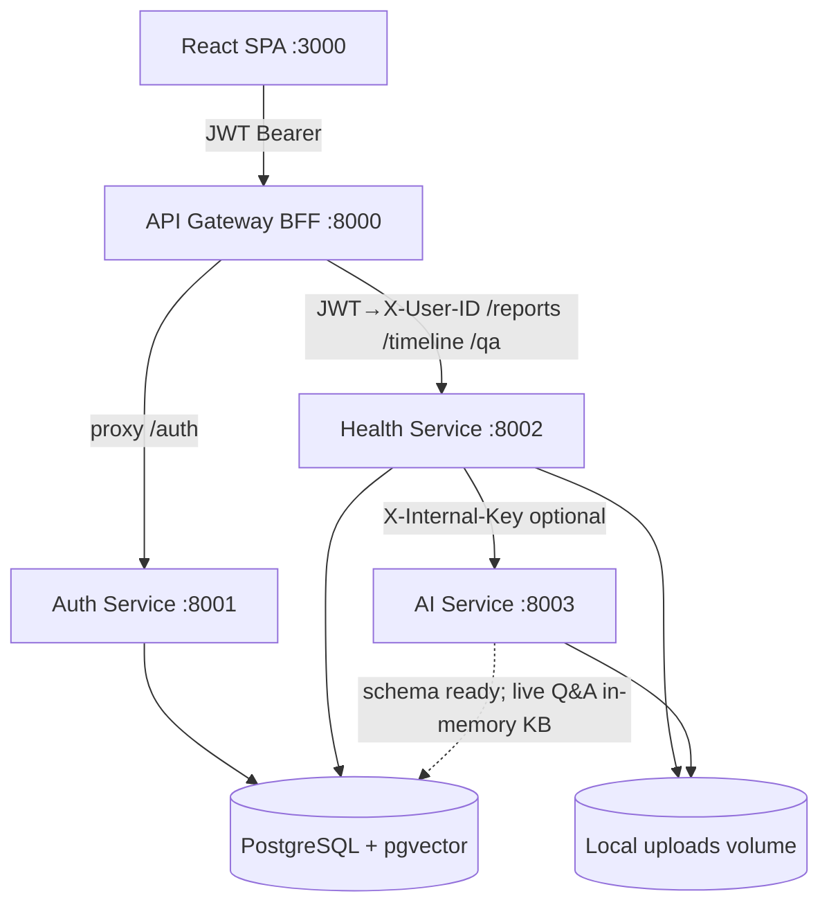
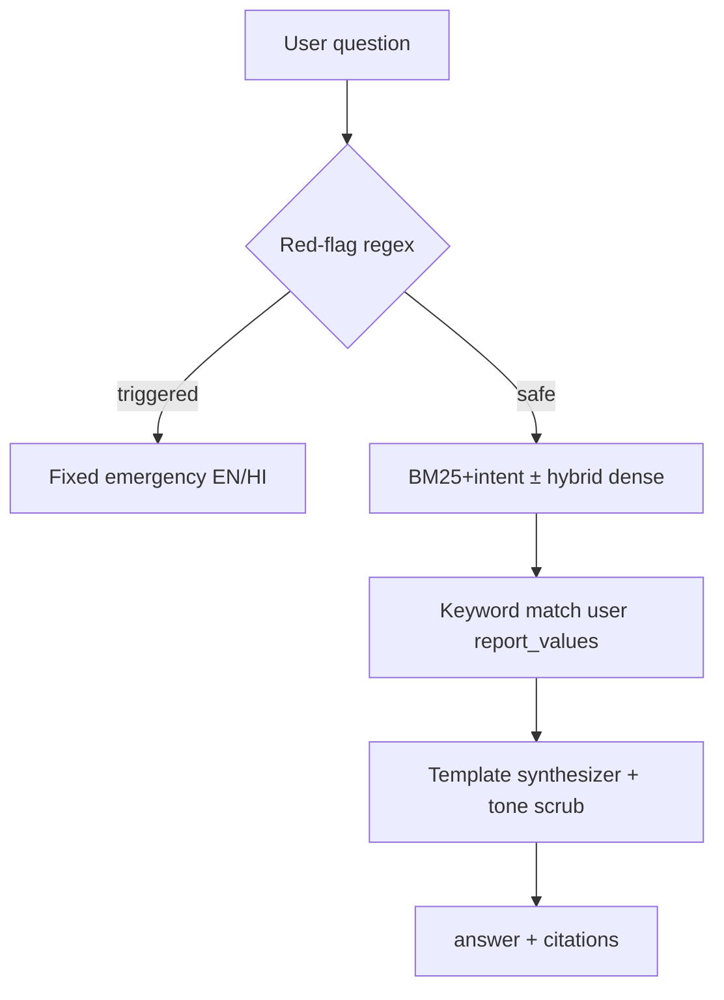
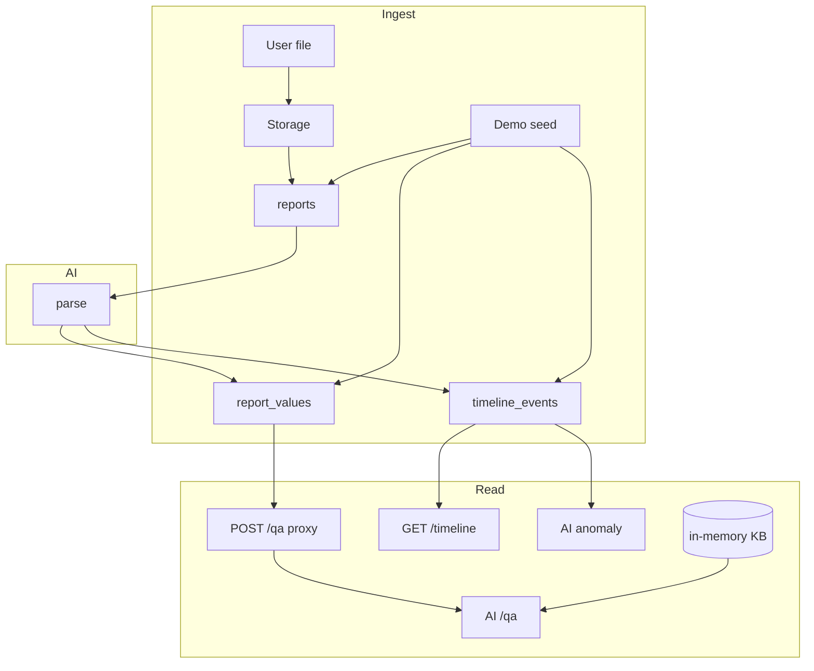
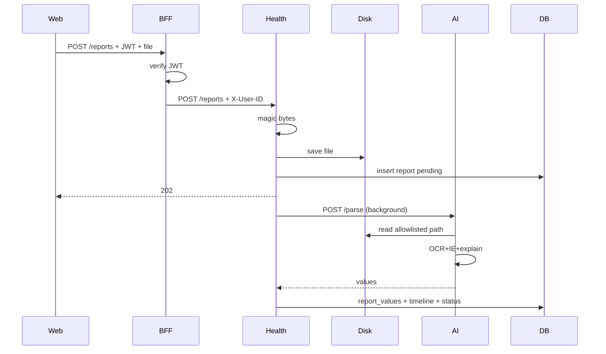

# MediVault AI — BIBLE.md

> **Definitive project knowledge base / institutional memory.**  
> Prefer this document over any individual README if the two disagree; then reconcile docs with code.  
> Short overview: [`README.md`](README.md). Demo: [`docs/DEMO_SCRIPT.md`](docs/DEMO_SCRIPT.md). Claims: [`docs/PRESENTATION_CLAIMS.md`](docs/PRESENTATION_CLAIMS.md).  
> **Last full audit for this encyclopedia:** 2026-08-10.

---

## Table of contents

1. [Executive Summary](#1-executive-summary)
2. [Repository Overview](#2-repository-overview)
3. [System Architecture](#3-system-architecture)
4. [Backend](#4-backend)
5. [Frontend](#5-frontend)
6. [AI / Machine Learning](#6-ai--machine-learning)
7. [Data Pipeline](#7-data-pipeline)
8. [Database](#8-database)
9. [APIs](#9-apis)
10. [Security](#10-security)
11. [Configuration](#11-configuration)
12. [Build & Deployment](#12-build--deployment)
13. [Testing](#13-testing)
14. [Performance](#14-performance)
15. [External Dependencies](#15-external-dependencies)
16. [Prompts & AI Instructions](#16-prompts--ai-instructions)
17. [Design Decisions (ADR)](#17-design-decisions-adr)
18. [Benchmarks](#18-benchmarks)
19. [Known Issues](#19-known-issues)
20. [Troubleshooting Guide](#20-troubleshooting-guide)
21. [Administrator Handbook](#21-administrator-handbook)
22. [Developer Handbook](#22-developer-handbook)
23. [Future Roadmap](#23-future-roadmap)
24. [Glossary](#24-glossary)
25. [Appendix](#25-appendix)

---

# 1. Executive Summary

## 1.1 Project overview

**MediVault AI** is a hackathon-stage microservices product that converts a person’s scattered medical **lab reports** (PDF/images) into an **owner-scoped health vault** with:

1. **Structured extraction** (OCR + regex information extraction) for CBC, lipid, thyroid, HbA1c panels  
2. **Bilingual plain-language explanations** (English + Hindi) that never issue a diagnosis  
3. **Longitudinal timeline + statistical personal-series anomaly monitoring**  
4. **Evidence-grounded Q&A** (BM25 default; optional semantic embeddings via `USE_EMBEDDING_SEARCH` + FAISS/NumPy; template synthesis, safety-first red-flag gate)

It is **not** an AI doctor, symptom-to-disease predictor, or free-form clinical chatbot.

## 1.2 Vision

Close the gap between “I’m fine” and “I need a doctor” by combining three capabilities that consumer tools usually ship in isolation:

| Pillar | Meaning in product terms |
|--------|---------------------------|
| Longitudinal memory | Owner-scoped history of reports and metrics across time |
| Trend / anomaly sensing | Flag *personal* patterns (z-score trend + causal z / CUSUM), not population ML diagnoses |
| Evidence-cited answers | Template answers with KB + user-value citations; no unsourced LLM prose |

## 1.3 Objectives

| Objective | MVP acceptance (from `docs/03_MVP_SCOPE.md`) | Status |
|-----------|-----------------------------------------------|--------|
| Medical report understanding | Extract common panels + plain-language summary | **Demoable** (typed PDF fragile; demo seed reliable) |
| Timeline + anomaly | ≥3 points → trend language, no diagnosis | **Demoable** (statistical monitor) |
| Evidence Q&A | Citations to KB + user values | **Demoable** (in-memory BM25 KB) |
| Deterministic safety | Red-flag → fixed emergency message &lt;100 ms | **Implemented** |

## 1.4 Core capabilities (as shipped)

- JWT register/login/`me` (bcrypt passwords, HS256 JWT)  
- BFF (`apps/api`) validates JWT, **strips client `X-User-ID`**, injects trusted owner id  
- Report upload (magic-byte MIME), async parse via FastAPI `BackgroundTasks`  
- Deterministic **demo seed** panels (`cbc` / `lipid`) without OCR  
- Timeline summary + per-metric history + anomaly proxy  
- Q&A proxy: loads owner `report_values` → AI safety → retrieve → synthesize  
- React SPA (Vite) on port 3000, proxies API to `:8000`

## 1.5 Current maturity

| Dimension | Level | Notes |
|-----------|-------|-------|
| Product features 1–3 | **Hackathon prototype** | Live demo path works |
| Production PHI readiness | **Not ready** | No encrypt-at-rest, no durable queue, no audit log, no TLS by default |
| ML credibility | **Honest synthetic evals** | Plan B + Plan C reports; no trained clinical models |
| Integration tests | **Empty** | Unit tests only |
| Schema durability | **Alembic 001–004** | Tables exist for Q&A persistence; live path may not fully write them |

**Authoritative short status:** `00_PROJECT_STATE.md` (updated 2026-08-10).

## 1.6 Technology stack

| Layer | Choice |
|-------|--------|
| Language (services) | Python 3.11+ |
| API framework | FastAPI + Uvicorn |
| Auth crypto | passlib/bcrypt, python-jose JWT |
| ORM / DB | SQLAlchemy 2 async + asyncpg; PostgreSQL 16 + **pgvector** image |
| Migrations | Alembic (`infra/migrations`) |
| OCR / PDF | Tesseract (pytesseract), pdfplumber, Pillow, pymupdf |
| ML (live path) | Pure stdlib stats + pure-Python BM25; optional sentence-transformers MiniLM |
| Gateway | FastAPI BFF `apps/api` |
| Frontend | React 18 + Vite 5 + lucide-react |
| Orchestration | Docker Compose |
| Lint / test | Ruff, pytest (asyncio auto) |

## 1.7 Design philosophy

1. **Ship narrow, ship real** — locked MVP; no resurrected “AI doctor” modules.  
2. **Safety is code, not model output** — red flags and tone templates are deterministic.  
3. **Owner-scoped by construction** — repository + FK `owner_id`, not only router checks.  
4. **Honesty in ML claims** — retract MD5-as-MiniLM; default demo is BM25, not dense.  
5. **Service boundaries early** — auth / health / AI separable for biometrics, ABHA, family later.  
6. **Delete means delete** — cascade FK + file storage delete for reports.

## 1.8 Major achievements

- Real BFF identity boundary (closed spoofed `X-User-ID` path for LAN browser demos).  
- Plan B: replaced IsolationForest + MD5 cosine “embeddings” with statistical monitor + BM25.  
- Plan C lab: IE F1 **0.9667**, tone violation **0.00** after scrub; no vanity training.  
- Demo seed + suggestion chips + preflight/smoke scripts for judge reliability.  
- Dual-layer privacy (ScopedRepository + DB `owner_id` FK).  
- Redacting logger enforced by culture and pre-commit guidance.

## 1.9 Known limitations (summary)

See §19. Critical ones for admins:

- Not a production PHI system  
- Live Q&A uses **in-memory** KB, not pgvector live retrieval  
- OCR quality on real Indian lab scans not rigorously measured  
- Gradual drift anomaly recall weaker than spike-only synth  
- Account deletion / consent / access audit incomplete  

## 1.10 Future roadmap (summary)

See §23: encrypt-at-rest, durable OCR queue, real MiniLM optional path when warm, Eka/NidaanKosha data acquisition, integration tests, pgvector live path, biometrics/ABHA only post-MVP.

---

# 2. Repository Overview

## 2.1 Root location

```
MediVault/   ← project root (this BIBLE.md lives here)
```

Workspace parent path may be `.../College/ML/`; the application repository is **`MediVault/`**.

## 2.2 Complete folder hierarchy (logical)

```
MediVault/
├── 00_PROJECT_STATE.md          # Session-start truth (short)
├── BIBLE.md                     # This encyclopedia
├── README.md                    # Human setup + API sketch
├── CONTRIBUTING.md              # Contributor workflow
├── implementation_plan.md       # Lightweight planning notes
├── conftest.py                  # Pytest path + hyphenated module finder
├── pyproject.toml               # Ruff + pytest config
├── docker-compose.yml           # postgres + four services
├── .env.example                 # Env template (never commit secrets)
├── .pre-commit-config.yaml
├── apps/
│   ├── api/                     # BFF / API gateway
│   └── web/                     # React SPA
├── services/
│   ├── auth-service/
│   ├── health-service/
│   └── ai-service/
├── packages/
│   ├── shared-types/            # Shared Pydantic/type aliases
│   └── shared-utils/            # Redacting logger
├── infra/migrations/            # Alembic
├── data/
│   ├── knowledge-base/          # Curated guideline .txt corpus
│   ├── datasets/                # Eval + Plan C lab + synthetic generators
│   └── uploads/                 # Local report storage (runtime; may be empty)
├── tests/
│   ├── unit/                    # Per-service unit tests
│   └── integration/             # Placeholder / empty
├── scripts/                     # Demo preflight & smoke (PowerShell)
└── docs/                        # Context, architecture, ship kit, ML reports
```

## 2.3 Directory responsibilities

| Path | Ownership / responsibility |
|------|----------------------------|
| `apps/api` | Only **public** entry for browser → auth + health. JWT + header injection. **Does not** expose AI. |
| `apps/web` | UI only; talks to BFF; never trusts client-side owner id. |
| `services/auth-service` | Users, bcrypt, JWT issue, `/auth/*`. |
| `services/health-service` | Reports, storage metadata, timeline, Q&A proxy, demo seed. |
| `services/ai-service` | OCR/parse/explain, anomaly, RAG, safety; **internal**. |
| `packages/shared-utils` | Logging redaction — mandatory for health paths. |
| `packages/shared-types` | Cross-service type literals (currently lean). |
| `infra/migrations` | Single source of schema truth (Alembic). |
| `data/knowledge-base` | Curated educational guideline text (shared, not PHI). |
| `data/datasets` | Evaluation harnesses and Plan C lab — not production runtime. |
| `tests` | Regression protection for privacy + ML tone + metrics. |
| `docs` | Product rules, demo scripts for judges, ML reports. |
| `scripts` | Day-of demo ops on Windows PowerShell. |

## 2.4 Important files

| File | Why it matters |
|------|----------------|
| `00_PROJECT_STATE.md` | What is demoable vs deferred **today** |
| `docs/01_PROJECT_CONTEXT.md` | Product vision & non-negotiables |
| `docs/02_ARCHITECTURE.md` | Target architecture principles |
| `docs/03_MVP_SCOPE.md` | Locked in/out scope |
| `docs/04_AGENT_RULES.md` | Agent/dev operating rules |
| `docs/DEV_LOG.md` | Why code looks this way (append-only) |
| `docs/ML_PLAN_B_RESULTS.md` / `PLAN_C_REPORT.md` | Benchmark truth |
| `docs/DEMO_SCRIPT.md` / `SHIP_CHECKLIST.md` / `JUDGE_QA.md` | Demo day |
| `conftest.py` | Maps `services.auth_service` → `services/auth-service` |
| `.env.example` | Complete env contract |

## 2.5 Ownership model

Services **do not** reach into another service’s tables; they call HTTP APIs. Shared code lives only under `packages/`. AI is reached **only** from health-service (and local fallback), never from the browser or BFF.

## 2.6 Conventions

- Disk folders: **hyphenated** (`ai-service`); Python imports: **underscored** via conftest finder (`services.ai_service`).  
- Routers: FastAPI `APIRouter` + service-local Pydantic schemas.  
- Health data access: `ScopedRepository` or explicit `owner_id` filters.  
- Logging: `from packages.shared_utils import get_logger` only.  
- Locales: `en-IN` | `hi-IN`.  
- Status enums: report `parsed_status ∈ {pending, processing, complete, failed}`.

---

# 3. System Architecture

## 3.1 High-level architecture



**Why this shape (see also architecture § ADR):** future biometrics/ID verification attach at **auth**; avatar/chat attach at **gateway or new BFF route**; health data ownership stays isolated; AI stays internal so spoofed headers cannot hit parse/anomaly from the LAN if ports bind to `127.0.0.1`.

## 3.2 Subsystem relationships

| From | To | Contract |
|------|-----|----------|
| Web | BFF | REST + JWT; Vite proxy paths `/auth`, `/reports`, `/timeline`, `/qa` |
| BFF | Auth | Transparent reverse-proxy of `/auth/*` |
| BFF | Health | Proxy with **trusted** `X-User-ID` = JWT `sub` |
| Health | AI `/parse` | After upload (BackgroundTasks); storage path + internal key |
| Health | AI `/anomaly/detect` | Timeline anomaly endpoint |
| Health | AI `/qa` | Q&A with injected `user_report_values` |
| AI | Disk | Read only under `STORAGE_LOCAL_PATH` |

## 3.3 Request lifecycle (authenticated health call)

```mermaid
sequenceDiagram
  participant U as Browser
  participant B as BFF
  participant H as Health
  participant A as AI
  participant D as Postgres

  U->>B: Authorization: Bearer JWT
  B->>B: jwt.decode(sub) ; strip client X-User-ID
  B->>H: forward + X-User-ID: sub
  H->>H: UUID(owner_id)
  H->>D: ScopedRepository(owner_id)
  opt Anomaly or Parse
    H->>A: httpx + X-Internal-Key
    A-->>H: JSON result
    H->>D: persist if parse
  end
  H-->>B: response
  B-->>U: response
```

## 3.4 Data lifecycle (report)

```mermaid
flowchart LR
  Upload[POST /reports multipart] --> MIME[Magic-byte sniff]
  MIME --> Store[LocalStorage under owner_id]
  Store --> Row[reports row pending]
  Row --> BG[BackgroundTasks]
  BG --> Parse[AI POST /parse]
  Parse --> OCR[pdfplumber / Tesseract]
  OCR --> IE[Regex ALL_PATTERNS]
  IE --> Explain[Template explainer EN/HI]
  Explain --> RV[report_values + explanations]
  RV --> TL[timeline_events if dates]
  TL --> Status[parsed_status complete|failed]
```

## 3.5 Q&A communication flow



## 3.6 Dependency diagram (runtime processes)

```
web → api → auth-service → postgres
         ↘ health-service → postgres
                          → ai-service (parse/anomaly/qa)
                          → local disk (uploads)
         ai-service → local disk
                   → (optional) MiniLM HF cache
```

---

# 4. Backend

## 4.1 Framework & patterns

All four Python apps are **FastAPI** applications with:

- `pydantic-settings` for configuration  
- `Depends()` for DB sessions, settings, auth header extraction  
- Async SQLAlchemy sessions in auth + health  
- httpx for service-to-service HTTP  
- Dual import layout: package-relative (`from .routers...`) with **flat-layout fallback** for Docker cwd

## 4.2 Service catalog

### 4.2.1 Auth Service (`services/auth-service`, port **8001**)

| Aspect | Detail |
|--------|--------|
| **Purpose** | Identity, credentials, JWT minting |
| **Entrypoint** | `main.py` → `routers/auth.py` |
| **Security** | `core/security.py` bcrypt + JWT |
| **DB** | `users` table via `UserRepository` |
| **Does not** | Store health data |

**Key functions:** `hash_password`, `verify_password`, `create_access_token`, `decode_access_token` (returns `None` on any failure — uniform 401).

### 4.2.2 Health Service (`services/health-service`, port **8002**)

| Aspect | Detail |
|--------|--------|
| **Purpose** | Report CRUD, storage, timeline, Q&A proxy, demo seed |
| **Entrypoints** | `routers/reports.py`, `timeline.py`, `qa.py` |
| **Repos** | `LocalStorage` abstraction; S3 fields exist in config, not fully swapped in MVP |
| **Identity** | **Only** `X-User-ID` header (trusted if only reachable via BFF/localhost) |

**Critical privacy base:** `db/base_repository.py` → `ScopedRepository`  
**Models:** `Report`, `ReportValue`, `TimelineEvent`  

**Background parse:** `_trigger_parse` creates a temporary engine/session to write results — MVP limitation vs durable job worker.

### 4.2.3 AI Service (`services/ai-service`, port **8003**)

| Module | Role |
|--------|------|
| `ocr/` | Tesseract backend + base interface |
| `parsers/` | Regex IE (`patterns.py`, `report_parser.py`) |
| `explainer/` | Status + bilingual templates |
| `anomaly/` | z-score trend + statistical monitor + detector summaries |
| `rag/` | ingest, BM25, intent, retriever, synthesizer, bootstrap, embedder |
| `safety/` | Red-flag rules |
| `core/internal_auth.py` | Internal key + path allowlist |
| `routers/*` | HTTP surface |

**Startup:** `bootstrap_knowledge_base()` loads KB into memory.  
**Health:** `GET /health` reports KB readiness stats.

### 4.2.4 API Gateway BFF (`apps/api`, port **8000**)

| Aspect | Detail |
|--------|--------|
| **Auth dependency** | `require_user_id` — decode JWT, validate UUID, return `sub` |
| **Proxy** | `routers/proxy.py` — strips hop-by-hop headers and **strips `X-User-ID`**, reinjects trusted id |
| **Proxied** | `/auth/*`, `/reports*`, `/timeline*`, `/qa*` |
| **Not proxied** | All AI service endpoints |

## 4.3 Routing map (implementation)

See §9 for full API contracts. Backend routers register prefixes matching those paths.

## 4.4 Dependency injection

- FastAPI `Depends(get_db)`, `Depends(get_settings)`, `Depends(_get_owner_id)`, `Depends(require_internal_key)`, `Depends(require_user_id)`.  
- Settings cached with `@lru_cache` on `get_settings()`.

## 4.5 Middleware & cross-cutting

- **CORS** on BFF (`CORS_ORIGINS`) for web origin  
- **Not present:** global rate limiting, request logging middleware for PHI access audit, OpenTelemetry  

## 4.6 Logging

`packages/shared-utils/logging.py`:

- StreamHandler + ISO-ish timestamps  
- Level from `LOG_LEVEL`  
- `_RedactingFilter` rewrites known sensitive JSON field patterns (`value`, `unit`, `reference_range*`, passwords)  

**Failure mode:** free-text logging of raw numbers without those JSON keys may **not** be redacted — discipline required.

## 4.7 Validation

- Pydantic models on all write bodies  
- EmailStr on register/login  
- Password min length 8  
- Locale checks `en-IN` | `hi-IN`  
- Magic-byte MIME allowlist on upload  
- Storage path must resolve under storage root  

## 4.8 Authentication / authorization (backend)

| Layer | Mechanism |
|-------|-----------|
| User → BFF | Bearer JWT (HS256), shared `AUTH_SECRET_KEY` with auth-service |
| BFF → Health | Trusted `X-User-ID` |
| Health → AI parse/anomaly | Optional `X-Internal-Key` if `INTERNAL_SERVICE_KEY` set |
| AI `/qa` | Requires `X-User-Id` header (not necessarily internal key) |

**Gap:** logout is client-side token discard only; no revocation store.  
**Gap:** health/AI trust X-User-ID if caller can reach them on network — mitigated by **compose bind to 127.0.0.1**.

## 4.9 Caching

- In-process KB + BM25 index in AI process memory  
- JWT is stateless (no session cache server-side)  
- Optional MiniLM singleton lazy cache  

## 4.10 Scheduling

No cron. OCR runs as FastAPI **BackgroundTasks** only.

## 4.11 Error handling patterns

- 401 missing/invalid identity  
- 404 for not-found **and** wrong owner (no enumeration)  
- 415 unsupported type  
- 413 oversized file (>20 MB)  
- 503 upstream AI/anomaly failures from health proxy  
- BFF returns JSON 503 with upstream type on connection errors  

## 4.12 Storage utilities

- `storage/base.py` — interface  
- `storage/local_storage.py` — filesystem under `STORAGE_LOCAL_PATH` / owner directories  

---

# 5. Frontend

## 5.1 Architecture

| Aspect | Detail |
|--------|--------|
| Stack | React 18 functional components, Vite 5 |
| Entry | `apps/web/src/main.jsx` → `App.jsx` |
| Global CSS | `index.css` (single stylesheet; no CSS modules/Tailwind) |
| API | `src/api.js` — only BFF; **never** AI URL; **never** client `X-User-ID` |
| Auth state | `localStorage.medivault_user` JSON `{ token, ... }` |
| Routing | **Tab state in App** (not React Router) |

## 5.2 Layout components

| Component | Responsibility |
|-----------|----------------|
| `Sidebar.jsx` | Nav tabs + logout + demo badge |
| `Header.jsx` | Title/subtitle + locale control |
| `AuthView.jsx` | Register/login (defaults favor register / judge email guidance) |
| `DashboardView.jsx` | Live report/metric counts, empty-state CTA, recent reports |
| `UploadView.jsx` | Real upload + poll + CBC/Lipid demo seed buttons |
| `TimelineView.jsx` | Metric list + anomaly analysis view + method disclaimer |
| `QAChatView.jsx` | Chat UI, suggestion chips, citations, safety highlighting |

## 5.3 Pages / tabs

| Tab id | View | Primary APIs |
|--------|------|--------------|
| `dashboard` | DashboardView | `listReports`, `getTimelineSummary` |
| `upload` | UploadView | `uploadReport`, `pollReportUntilDone`, `seedDemoReport`, `getReport` |
| `timeline` | TimelineView | `getTimelineSummary`, `getTimelineAnomaly` |
| `chat` | QAChatView | `askQuestion` |

## 5.4 State management

- Local `useState` / `useEffect` only (no Redux/Zustand).  
- Token from App; children receive `token` props.  
- Locale `en-IN` | `hi-IN` driven from profile when available.  

## 5.5 API communication

```js
// VITE_API_BASE empty → same origin; Vite proxies to :8000 in dev
const API_BASE = import.meta.env.VITE_API_BASE || '';
```

Proxy config (`vite.config.js`): `/auth`, `/reports`, `/timeline`, `/qa`, `/health` → `http://127.0.0.1:8000`.

## 5.6 Charts

No chart library. Timeline is textual/list presentation. Anomaly results show scores/methods as text.

## 5.7 Forms & errors

- Auth forms with validation messaging from API `detail`  
- Upload errors via thrown `Error` from `parseError`  
- Dashboard `bootError` when gateway down  
- Logout on failed `me()` (stale token)

## 5.8 Loading states

- Polling loop for report parse (`pollReportUntilDone`: 90s timeout / 1.5s interval)  
- Chat and timeline components show loading flags while requesting  

## 5.9 Performance

- Small SPA; no code-splitting required at current size  
- Lucide icons tree-shaken via imports  
- Avoided heavy chart/SSR frameworks deliberately for MVP  

## 5.10 Accessibility notes

- Partial: logout `aria-label`, some `role="alert"`  
- Full WCAG AA **not** done (explicitly deferred)

---

# 6. AI / Machine Learning

This is the scientific core of the repository. **Product pitch must match this section.**

## 6.1 ML / IR objectives

| Problem | Formulation | Success criterion |
|---------|-------------|-------------------|
| Lab IE | Extract canonical fields from OCR text | Field precision/recall on fixtures |
| Explanation | Map value vs ref-range → non-diagnostic bilingual text | Template + tests; no diagnosis strings |
| Personal anomaly | Given short series \(x_{1:t}\), flag unusual last point | Precision/recall/F1/FAR on synthetic sets |
| Retrieval | Rank KB chunks for FAQ queries | Hit@5, MRR |
| Answer gen | Produce cited bilingual text without free-form LLM | Tone violation rate; citation present |
| Safety | Detect emergency phrasing | Deterministic trigger tests |

## 6.2 End-to-end AI architecture (production path)

```
PDF/Image bytes
  → OCR backend (pdfplumber text layer preferred; Tesseract for images)
  → ReportParser (regex ALL_PATTERNS, first-win dedupe)
  → Explainer templates (status normal|high|low|unknown)

Metric time series (date, value)[]
  → compute_zscore  (trend + whole-series latest z)
  → score_anomaly   (causal z ∨ CUSUM; %Δ for score/summary)
  → detector bilingual summaries (+ optional soft ref-range note)

User question
  → check_safety (regex) [HARD GATE]
  → retrieve: BM25(+intent) [default] or SemanticRetriever when USE_EMBEDDING_SEARCH=1
             + keyword match on owner report_values
  → synthesize templates + tone scrub
```

## 6.3 Information extraction (IE)

### Purpose / responsibility

Turn free text from lab reports into structured `ParsedValue` objects.

### Method

**Default (production):**

- Hand-authored regex patterns with aliases for Indian lab nomenclature  
- Separators: `[\s:|=\t.]+`  
- Panels: CBC, Lipid Profile, Thyroid, HbA1c  
- First match per canonical test name wins  

**Optional Phase 1 / 1A (`USE_UNLIMITED_OCR=1`):**

- Unlimited-OCR VLM → Medical JSON → `ParsedValue` mapping  
- Automatic fallback to regex on crash, timeout, malformed JSON, **or empty labs**  
- `auto` backend never auto-loads local HF weights (Phase 1A hang/OOM fix)  
- Public `/parse` response schema unchanged  
- See `models/ocr/`, `phase1a-summary.md`, `docs/CONFIGURATION.md`

### Why regex remains default

Plan C: Field F1 **~0.97** on synthetic fixtures. Phase 1 offline Unlimited **postprocess** F1 is lower without alias normalizer; VLM weights not the production default until labeled-scan gates pass.

**Phase 2 normalizer (`USE_ML_NORMALIZER`):** maps raw/surface names → product canons + curated LOINC (internal). Default **off** = expanded `AliasNormalizer`. Flag on = `MedicalTestNormalizer` (char_tfidf online default; ModernBERT/ClinicalBERT pluggable) with rule fallback. Applied in `/parse` after extract — DB column names improve without schema change.

### Limitations

- Synthetic F1 ≠ scanned India PDF CER  
- Handwriting fragile  
- Messy thyroid fixtures showed lower precision (FP aliases)  
- Unlimited path improves vs gold when Phase 2 normalizer enabled on surface OCR names  

## 6.4 OCR

| Backend | Role |
|---------|------|
| `TesseractBackend` | Default images + PDF OCR fallback |
| pdfplumber / pymupdf | Typed PDF text extraction |
| Unlimited-OCR (`models/ocr`) | Optional VLM path (`USE_UNLIMITED_OCR`) |

**Why local Tesseract:** avoid sending PHI to cloud OCR.  
**Failure:** missing `tesseract` binary → parse fails / empty text.

## 6.5 Explainer (deterministic)

- Status from value vs reference interval  
- `templates.py` per-test “what it is” + high/low notes  
- Always steer to “discuss with doctor”, never “you have disease X”  

## 6.6 Anomaly detection

### 6.6.1 Problem formulation

Short outpatient personal series: typically \(n \approx 3\)–\(10\), one dimension per metric. **Not** population classification.

### 6.6.2 Component A — trend z-score (`zscore.py`)

For series values \(v_1 \ldots v_n\), \(n \ge 3\):

\[
\mu = \frac{1}{n}\sum v_i,\quad
\sigma = \sqrt{\frac{1}{n}\sum (v_i-\mu)^2},\quad
z_i = \frac{v_i-\mu}{\sigma}
\]

- **Latest z** reported for the most recent point  
- **Out-of-range streak:** consecutive trailing points with \(|z| > 2\)  
- **Trend:** least-squares slope of \((i, v_i)\) normalised by \(\sigma\); compare to threshold \(\pm 0.25\) for rising/falling/stable  

### 6.6.3 Component B — statistical personal-series monitor (`model.py`)

Replaces **IsolationForest** (unfit for tiny 1-D series with forced contamination).

**Leave-last-out baseline** from past \(x_{1:t-1}\):

\[
\mu_{\text{past}},\; \sigma_{\text{past}};\quad
z_t = \frac{x_t - \mu_{\text{past}}}{\sigma_{\text{past}}}
\]

**Relative jump:**

\[
\Delta_t = \frac{x_t - x_{t-1}}{\max(|x_{t-1}|, 10^{-6})}
\]

**Two-sided tabular CUSUM** on residuals with \(k = 0.5\sigma\), \(h = 4\sigma\):

\[
S^+_i = \max(0, S^+_{i-1} + (x_i-\mu) - k),\quad
S^-_i = \max(0, S^-_{i-1} - (x_i-\mu) - k)
\]

Alarm if \(S^+ > h\) or \(S^- > h\).

**Binary decision (production):**

\[
\text{is\_anomaly} = \big(|z_t| \ge 2\big) \;\lor\; \text{CUSUM alarm}
\]

\(\Delta_t\) is **not** OR-ed into the binary decision (Plan B ablation: raised FAR). It still contributes to continuous score and bilingual copy when \(|\Delta| \ge 0.25\) for narrative (detector uses 10% for *mention* of change).

**Score convention (API stable)** \(s \in [-1, +1]\):

\[
\text{strength} = \max\!\left(\min\!\left(\frac{|z|}{3},1\right),\;
\min\!\left(\frac{|\Delta|}{0.5},1\right),\;
\min\!\left(\frac{S_{\text{mag}}}{h},1\right)\right),\quad
s = 1 - 2\cdot\text{strength}
\]

### 6.6.4 Component C — summary generation (`detector.py`)

Bilingual templates; optional **soft** ref-range note when latest value outside lab interval — **must not flip `is_anomaly`** (Plan C FAR veto on OR-ref-range).

### 6.6.5 Rejected approaches (anomaly)

| Approach | Why rejected |
|----------|--------------|
| IsolationForest | Contamination forces outliers; poor on n≈5–10 |
| XGBoost / LSTM | No adequate longitudinal outpatient training set; unexplainable for pitch |
| OR ref-range into is_anomaly | F1 sometimes up, **FAR up** — Guardian veto |
| AND ref-range | Recall stuck low on mixed regimes |

## 6.7 Retrieval (RAG)

### 6.7.1 Corpus

`data/knowledge-base/*.txt` (~5 files; ~O(10–20) chunks after ~300-word / 50-word overlap chunking). Educational guidelines (CBC, lipid, thyroid, HbA1c, general health).

### 6.7.2 BM25 (`bm25.py`)

Okapi BM25 pure Python: \(k1=1.5\), \(b=0.75\), Robertson–Sparck Jones IDF smoothing, English stopword list so function words don’t drown lab terms.

### 6.7.3 Intent boost (`intent.py`)

Deterministic keyword intents: cbc / lipid / thyroid / hba1c / general. Additive boosts (e.g. 0.18 per hit) capped at **0.35**.

\[
\text{score}_{\text{bm25+intent}} = \text{norm}(BM25) + \min\!\left(\sum boosts, 0.35\right)
\]

### 6.7.4 Optional dense hybrid

When `MEDIVAULT_FAST_KB=0` and `MEDIVAULT_USE_DENSE=1` and MiniLM loads:

\[
\text{score} = 0.7\cdot\text{norm}(BM25) + 0.3\cdot\text{norm}(\cos(q, e_i)) + \text{boost}
\]

Model: `sentence-transformers/all-MiniLM-L6-v2`, 384-d.

**Demo default:** FAST_KB=1 → **no** HF download; pure BM25 path via `USE_EMBEDDING_SEARCH=0`.

**Phase 3:** `USE_EMBEDDING_SEARCH=1` selects `SemanticRetriever` (BGE-small primary / MiniLM fallback / offline TF-IDF, FAISS or NumPy index) with automatic BM25 fallback. Public `/qa` contract unchanged. See `models/retrieval/`, `phase3-summary.md`.

### 6.7.5 User data retrieval

Keyword/synonym match on injected owner `report_values` (score ~0.85 if match). Not vectorised user embeddings in MVP (`/embeddings/embed-report` is a **stub**).

### 6.7.6 Why not live pgvector

Schema exists (`knowledge_documents`). Live service bootstraps **files → memory** for demo reliability and to avoid DB coupling on tiny corpus. pgvector path is architectural future, not current live Q&A.

## 6.8 Answer synthesis

Template assembly of key sentences (first ≤3 meaningful) + citation indices + user data section + fixed consult disclaimer. **No LLM API.**

Tone sanitizer rewrites diagnostic substrings leaked from KB (Plan C).

Hindi body uses **lightweight phrase map**, not full NMT — disclosed limitation.

## 6.9 Safety layer

Five categories: cardiac emergency, GI bleeding, vision loss, stroke, suicidal ideation.  
EN + HI fixed messages. First matching rule wins. **Must run before retrieval** (`routers/qa.py`).

Rejected: ML classifier safety (non-determinism & false negatives on emergencies unacceptable).

## 6.10 Confidence estimation

| System | Confidence proxy |
|--------|------------------|
| Anomaly | `anomaly_score` in [-1,1] + trigger feature flags (causal_z, pct_delta, cusum) |
| Retrieval | Normalised BM25/hybrid score; not calibrated probability |
| IE | Implicit via match presence only |
| Safety | Binary |

## 6.11 Explainability

- Anomaly: method string, triggers, z, %Δ, CUSUM alarm  
- RAG: inline `[n]` + sources list  
- IE: regex capture groups transparent  

## 6.12 Deterministic vs optional trainable

| Component | Trainable? | Live default |
|-----------|------------|--------------|
| Safety, IE patterns, templates, BM25, intent, stats monitor | No / fixed code | Production |
| MiniLM | Pretrained external weights only | Off |
| Finetuned IF/XGB/LLM | Rejected | Not in repo |

## 6.13 Evaluation / ablates

See §18 and docs:

- `docs/ML_PLAN_B_RESULTS.md`  
- `docs/PLAN_C_REPORT.md`  
- `data/datasets/evaluate_rag.py`  
- `data/datasets/generate_synthetic_anomaly_data.py`  
- `data/datasets/plan_c/*` + `results_latest.json`

---

# 7. Data Pipeline

## 7.1 Ingestion sources

| Source | Pipeline |
|--------|----------|
| User multipart upload | MIME sniff → LocalStorage → reports row → async AI parse |
| Demo seed | In-process synthetic values + timeline (no OCR) |
| Knowledge base txt | Startup bootstrap → chunk → (optional embed) → BM25 |

## 7.2 Parse pipeline detail

1. Read bytes only if path under storage root  
2. OCR extract_text(mime)  
3. Clean ZWSP / whitespace  
4. `ALL_PATTERNS` scan  
5. Decimal normalize (comma → dot)  
6. Explain each value  
7. Health persists values + timeline  

**Output to DB:** `report_values` incl. `explanation_en/hi` (migration 004).

## 7.3 Timeline derivation

Events require `date_of_test`. Demo lipid seeds **extra historical LDL** points for anomaly demos.

## 7.4 Q&A value injection

Health loads up to **50** latest `ReportValue` rows for owner, serialises JSON for AI retriever.

## 7.5 Validation & cleaning

- MIME allowlist + magic bytes  
- Max 20MB  
- Decimal conversion failures → `value_text` fallback  
- Safety/tone cleaning on Q&A answers  

## 7.6 Storage & indexing

- Files: local disk hierarchical by owner  
- DB indexes: owner_id, (owner_id, test_name, date), report_id, etc.  
- KB: in-memory inverted structures in BM25Index  

## 7.7 Complete data flow diagram



---

# 8. Database

## 8.1 Engine & image

- PostgreSQL 16 via `pgvector/pgvector:pg16`  
- Async URL construction in service settings (`postgresql+asyncpg://...`)  
- Extension: `CREATE EXTENSION IF NOT EXISTS vector` in migrations 001/003  

## 8.2 Schema overview

### `users` (001)

| Column | Notes |
|--------|-------|
| id UUID PK | gen_random_uuid |
| email unique | indexed |
| hashed_password | bcrypt |
| locale_preference | check en-IN / hi-IN |
| created_at, deleted_at, is_active | soft-delete field present; hard-delete cascades health data |

### `reports` (002)

owner_id FK CASCADE; original_filename; storage_path; mime_type; parsed_status check constraint; uploaded_at; parsed_at.

### `report_values` (002 + 004)

owner_id denormalised for local scoping; test_name; panel; numeric/text value; unit; reference ranges; date_of_test; **explanation_en/hi**; created_at.

### `timeline_events` (002)

owner_id; test_name; values; **required** date_of_test; source_report_id FK CASCADE.

### `knowledge_documents` (003)

Shared corpus: source_title/url/licence; chunk_text; chunk_index; embedding **vector(384)**. **No owner_id.**

### `qa_sessions` / `qa_messages` (003)

owner_id scoped; messages store role, content, content_hi, citations JSON, safety_triggered.

**Note:** Live Q&A path as implemented primarily **returns answers over HTTP**; durable session write usage may be incomplete relative to schema ambition — treat tables as schema readiness.

## 8.3 Relationships

```
users 1—* reports 1—* report_values
users 1—* timeline_events *—1 reports
users 1—* qa_sessions 1—* qa_messages
knowledge_documents (shared)
```

## 8.4 Indexes & constraints

- FK ON DELETE CASCADE for privacy cascade delete  
- Check constraints for locale and parsed_status  
- Composite index report_values (owner_id, test_name, date_of_test)  
- Timeline indexes for owner + test  

## 8.5 Migrations procedure

```bash
cd infra/migrations
alembic upgrade head
```

Chain: `001` → `002` → `003` → `004`.  
Config: `alembic.ini` + `env.py` (async-aware).

## 8.6 Optimization strategy

- Scoped queries always filter owner_id (index friendly)  
- Small personal series → no heavy OLAP  
- Avoid loading large files into DB (paths only)

## 8.7 Backup strategy (current reality)

- Docker volume `postgres_data` — **operator must snapshot**  
- No automated backup job in repo  
- Report files on volume `uploads_data` — back up with DB or lose binaries  

---

# 9. APIs

Convention:  
- **Public (browser):** only via BFF `:8000`  
- **Internal AI:** `:8003` (not via BFF)

## 9.1 Auth Service (also via `/auth` on BFF)

### `POST /auth/register`

| | |
|--|--|
| **Purpose** | Create user + return JWT |
| **Body** | `{ "email", "password" (≥8), "locale_preference"? }` |
| **Auth** | None |
| **Success** | `201` `{ access_token, token_type: "bearer" }` |
| **Failures** | `400` bad locale; `409` email taken |

### `POST /auth/login`

| | |
|--|--|
| **Body** | `{ email, password }` |
| **Success** | `200` token |
| **Failures** | `401` Invalid credentials (no email enumeration split) |

### `GET /auth/me`

| | |
|--|--|
| **Auth** | Bearer JWT |
| **Success** | `{ id, email, locale_preference }` |
| **Failures** | `401` invalid token; `404` user missing |

## 9.2 Health — Reports (BFF `/reports`)

All health routes require BFF-injected `X-User-ID` (UUID).

### `POST /reports` (multipart)

| | |
|--|--|
| **Purpose** | Upload report; async OCR |
| **Input** | file field |
| **Success** | `202` ReportOut `{ id, original_filename, parsed_status, uploaded_at }` |
| **Failures** | `401`; `413` size; `415` type |

### `POST /reports/demo/seed?panel=cbc|lipid`

| | |
|--|--|
| **Purpose** | Deterministic judge path |
| **Success** | `201` ReportDetailOut with values + explanations |
| **Failures** | `400` bad panel |

### `GET /reports`

List ReportOut for owner.

### `GET /reports/{id}`

Detail + values; `404` if other user’s id.

### `DELETE /reports/{id}`

`204` hard delete + file; cascade children.

## 9.3 Health — Timeline

### `GET /timeline`

List summary items: test_name, unit, latest_date, latest values, data_point_count.

### `GET /timeline/{test_name}`

Full history oldest→newest.

### `GET /timeline/{test_name}/anomaly`

History + AI detection fields (`trend`, `anomaly_score`, `is_anomaly`, `z_score`, `out_of_range_streak`, `method`, `data_points_used`, `summary_en`, `summary_hi`, `history`).  
`503` if AI down; `404` if no data.

## 9.4 Health — Q&A

### `POST /qa`

| | |
|--|--|
| **Body** | `{ question, locale?, session_id? }` |
| **Server adds** | `user_report_values` for owner |
| **Response** | `{ session_id, answer, answer_hi, citations[], safety_triggered }` |
| **Failures** | `503` AI unavailable (may attempt process-local fallback) |

## 9.5 AI — Internal

### `POST /parse`

```json
{
  "report_id": "uuid",
  "owner_id": "uuid",
  "storage_path": "/path/under/root",
  "mime_type": "application/pdf",
  "locale": "en-IN"
}
```

**Auth:** `X-Internal-Key` if configured.  
**Response:** `{ report_id, values: [ ParsedValueOut... ] }`  
**Failures:** `401` key; `403` path escape; `404` missing file.

### `POST /anomaly/detect`

```json
{
  "test_name": "LDL Cholesterol",
  "unit": "mg/dL",
  "data_points": [{"date":"2024-01-01","value":120}, ...],
  "reference_range_low": null,
  "reference_range_high": null
}
```

**Response:** detection fields (no history — history attached by health).

### `POST /qa` (AI)

Requires `X-User-Id`. Accepts optional `user_report_values`.  
**Order:** safety → retrieve → synthesize.

### `POST /embeddings/embed-report` / `DELETE /embeddings/{owner_id}/{report_id}`

Stubs; log + noop success for contract completeness.

### `GET /health`

`{ status, service, kb_ready, kb_chunks, kb_retriever, kb_embedder }`.

---

# 10. Security

## 10.1 Authentication

- Passwords: bcrypt via passlib  
- Tokens: HS256 JWT with `sub`, `exp`, `iat`  
- Expiry: `AUTH_ACCESS_TOKEN_EXPIRE_MINUTES` (default 60)

## 10.2 Authorization

- Data plane: every health query requires owner_id  
- Object enumeration defense: 404 for wrong owner  
- AI embed delete: `X-User-Id` must equal path `owner_id`

## 10.3 Secrets

| Secret | Used by |
|--------|---------|
| `POSTGRES_PASSWORD` | DB |
| `AUTH_SECRET_KEY` | auth + BFF (must match) |
| `INTERNAL_SERVICE_KEY` | health → AI |

Never commit `.env`. Rotate after demos if exposed.

## 10.4 Encryption

| Property | Status |
|----------|--------|
| TLS | Not enabled by compose by default |
| Encryption at rest (DB/files) | **Not implemented** |
| JWT secrets | HMAC only |

## 10.5 Rate limiting

Not implemented. Demo assumes trusted local network.

## 10.6 Input validation

- Pydantic, MIME magic, size limits, question max 2000 chars  
- Regex safety on free text  

## 10.7 File validation

Magic signatures: PDF, JPEG, PNG, TIFF, WEBP. Prefer sniffed type over declared Content-Type.

## 10.8 Path traversal

`resolve_safe_storage_path` rejects paths outside storage root.

## 10.9 Prompt / AI safety

- Templates bound generation space  
- Tone scrub  
- Safety layer overrides all generation  
- **No** unrestricted generative medical LLM in production path  

## 10.10 Network / deployment security

- Compose binds postgres, auth, health, AI to `127.0.0.1`  
- BFF publishes `:8000` (demo public entry)  
- **Do not** publish 8002/8003 publicly  

## 10.11 Logging safety

Redacting filter + cultural rule: no raw health values in logs.

## 10.12 Gaps vs architecture doc §5

Missing for production: encrypt-at-rest, access audit log, durable worker isolation, token revocation, formal consent, TLS termination.

---

# 11. Configuration

## 11.1 Environment variables (from `.env.example`)

| Variable | Affects | Notes |
|----------|---------|-------|
| `POSTGRES_HOST` | DB connectivity | `postgres` in compose |
| `POSTGRES_PORT` | DB | 5432 |
| `POSTGRES_DB` | DB name | |
| `POSTGRES_USER` | DB user | |
| `POSTGRES_PASSWORD` | **Required** | Change default |
| `AUTH_SECRET_KEY` | JWT sign/verify | ≥32 chars random; shared auth+BFF |
| `AUTH_ALGORITHM` | JWT alg | HS256 |
| `AUTH_ACCESS_TOKEN_EXPIRE_MINUTES` | Session length | 60 |
| `INTERNAL_SERVICE_KEY` | AI internal auth | Empty = tests skip key check |
| `STORAGE_BACKEND` | Storage mode | `local` for MVP |
| `STORAGE_LOCAL_PATH` | Upload root | `./data/uploads` or `/data/uploads` |
| `STORAGE_S3_*` | Future S3 | Not primary path |
| `EMBEDDING_MODEL` | Dense path name | MiniLM string |
| `TESSERACT_CMD` | OCR binary | `tesseract` |
| `MEDIVAULT_FAST_KB` | AI boot | `1` = BM25-only demo default |
| `MEDIVAULT_USE_DENSE` | Hybrid retrieval | Requires FAST_KB=0 |
| `AUTH_SERVICE_URL` | BFF/health targets | |
| `HEALTH_SERVICE_URL` | BFF | |
| `AI_SERVICE_URL` | Health → AI | |
| `CORS_ORIGINS` | BFF CORS | localhost:3000 |
| `LOG_LEVEL` | Logging | INFO default |
| `VITE_API_BASE` | Frontend base URL | Empty uses Vite proxy |

## 11.2 Feature flags (effective)

| Flag combo | Behavior |
|------------|----------|
| `MEDIVAULT_FAST_KB=1` | Skip MiniLM; BM25 |
| `FAST_KB=0` + `USE_DENSE=1` | Try hybrid; fall back BM25 on error |
| Empty `INTERNAL_SERVICE_KEY` | No internal key requirement |

## 11.3 Service Settings modules

Each of auth/health/ai/api has `core/config.py` pydantic Settings reading `.env` with `extra="ignore"`.

## 11.4 Build configuration

- `pyproject.toml` — Ruff rules + pytest asyncio  
- Dockerfiles per service/api (repo root context so `packages/` copies)  
- `apps/web/package.json` scripts: dev/build/preview  

## 11.5 Alembic

`infra/migrations/alembic.ini` — URL generally driven by env in `env.py`.

---

# 12. Build & Deployment

## 12.1 Installation (local)

1. Python 3.11+ venv  
2. `pip install -r` for auth, health, ai requirements  
3. `cp .env.example .env` and set secrets  
4. `docker-compose up -d postgres`  
5. `alembic upgrade head` from `infra/migrations`  
6. Optional: install Tesseract system package  
7. Web: `cd apps/web && npm install`

## 12.2 Running processes (hackathon)

```powershell
# Repo root
$env:PYTHONPATH="."
uvicorn services.auth_service.main:app --reload --port 8001
uvicorn services.health_service.main:app --reload --port 8002
uvicorn services.ai_service.main:app --reload --port 8003
# BFF
cd apps/api; uvicorn main:app --reload --port 8000
# Web
cd apps/web; npm run dev
```

**Note:** Import path `services.auth_service` relies on conftest’s finder **or** equivalent path setup; Docker images set working layout accordingly.

## 12.3 Docker Compose

Services: `postgres`, `auth-service`, `health-service`, `ai-service`, `api`.  
Volumes: `postgres_data`, `uploads_data` (shared health+AI).  

```bash
docker-compose up --build
```

Web still typically run via Vite outside compose for hot reload.

## 12.4 CI/CD

No GitHub Actions / pipeline files observed in-repo. Quality is local pytest + ruff + pre-commit.

## 12.5 Monitoring

- `GET /health` on AI (and likely health endpoints per service main)  
- Logs to stdout  

No Prometheus/Grafana.

## 12.6 Rollback

- DB: `alembic downgrade -1` (test carefully)  
- App: redeploy previous image/tag; regenerate secrets if compromised  
- No automated blue-green  

## 12.7 Demo ops scripts

- `scripts/demo_preflight.ps1`  
- `scripts/smoke_demo.ps1`  

## 12.8 Production deployment (honest)

Not production-certified. If pressed into staging:

1. TLS reverse proxy terminating at BFF only  
2. Never publish AI/health ports  
3. Secrets manager  
4. Encrypt volumes  
5. Replace BackgroundTasks with a real queue  
6. Backup volumes  

---

# 13. Testing

## 13.1 Strategy

| Layer | Path | Focus |
|-------|------|-------|
| Unit | `tests/unit/auth-service` | JWT, register/login |
| Unit | `tests/unit/health-service` | Reports, timeline, QA proxy scoping |
| Unit | `tests/unit/ai-service` | Parser, anomaly, RAG, safety, plan_c smoke |
| Integration | `tests/integration` | **Empty / WIP** |
| Offline eval | `data/datasets/*` | Metrics, not pytest CI by default |

Root `conftest.py` injects hyphenated module resolution.

## 13.2 How to run

```bash
# From MediVault root
# Windows:
$env:PYTHONPATH="."; python -m pytest
# Unix:
PYTHONPATH=. python -m pytest -v
```

## 13.3 Coverage highlights

- Owner scoping tests needed for any new health endpoint (project rule)  
- Anomaly tone rules enforced by `test_anomaly.py`  
- Safety determinism by `test_safety.py`  
- RAG scoring interfaces by `test_rag.py`  

## 13.4 Benchmarks / eval scripts

| Script | Role |
|--------|------|
| `evaluate_rag.py` | Hit@5 / MRR / tone metrics |
| `generate_synthetic_anomaly_data.py` | Synth Hb spike patients |
| `plan_c/run_plan_c_lab.py` | Orchestrates IE, tone, anomaly regimes, dense bake-off |

## 13.5 Regression protection

- No flaky HF downloads in default unit path  
- Synthetic seeds (e.g. random.seed(42) in Plan B) for anomaly numbers  

---

# 14. Performance

## 14.1 Bottlenecks

| Area | Risk |
|------|------|
| OCR/Tesseract | Slow/variable on large images |
| BackgroundTasks in-process | No horizontal worker; lost work if process restarts mid-parse |
| MiniLM cold start | ~tens–100s of seconds HF download — **demo killer** |
| httpx new client per call | Fine for demo volume; overhead at scale |
| Full table scans without filters | Mitigated by owner indexes if always used |

## 14.2 Optimization decisions

- BM25-only default for demo reliability  
- Template synthesis vs LLM latency  
- Statistical monitor has **zero sklearn** on live path  
- Chunk ~300 words balances recall with tiny corpus  

## 14.3 Caching

- KB in RAM for process lifetime  
- MiniLM singleton when dense  

## 14.4 Latency / throughput expectations

| Path | Expectation |
|------|-------------|
| Safety check | &lt;100ms |
| Q&A BM25 | low tens of ms + Python overhead |
| Anomaly | sub-ms–ms for n&lt;50 |
| Full PDF OCR parse | seconds–tens of seconds |

## 14.5 Memory

MiniLM ~80MB+ weights when loaded; Postgres + three Python APIs otherwise modest.

## 14.6 Trade-offs

Reliability & honesty &gt; marginal MRR from cold dense models on stage.

---

# 15. External Dependencies

## 15.1 Python (selected)

| Package | Purpose | Why selected | Alternatives rejected | Risk / license |
|---------|---------|--------------|----------------------|----------------|
| FastAPI | HTTP APIs | Async, OpenAPI, ML ecosystem | Flask (less async ergonomics) | MIT; mature |
| Uvicorn | ASGI server | Standard | Hypercorn | BSD |
| SQLAlchemy 2 | ORM | Async support | Raw SQL only | MIT |
| asyncpg | PG driver | Performance | psycopg async | Apache |
| Alembic | Migrations | Industry standard | hand SQL | MIT |
| pydantic-settings | Config | Typed env | os.environ soup | MIT |
| python-jose | JWT | HS256 simple | PyJWT | MIT; watch crypto hygiene |
| passlib + bcrypt | Passwords | Proven | argon2 (ok alt) | |
| httpx | S2S HTTP | Async client | requests | BSD |
| pdfplumber | PDF text | Good typed PDFs | only pymupdf | MIT |
| pytesseract | OCR bridge | Local PHI | cloud OCR APIs | Apache |
| Pillow | Images | Standard | — | HPND |
| scikit-learn / numpy | Dep present; **IF removed from prod path** | Historical Plan A | — | keep or prune later |
| sentence-transformers | Optional dense | Small MiniLM | larger medical embedders | Apache-2.0 model cards |
| pgvector (Python) | Vector ops type | Future DB path | dedicated vector DB | MIT |
| boto3 | Future S3 | Config stubs | local only | Apache |

## 15.2 JS

| Package | Purpose |
|---------|---------|
| react / react-dom | UI |
| vite | Dev server & build |
| lucide-react | Icons |

## 15.3 System

| Dependency | Purpose |
|------------|---------|
| Docker / Compose | Postgres + services |
| Tesseract OCR (+ hin optional) | OCR |
| Node.js / npm | Frontend |

## 15.4 Maintenance risk

- `python-jose` / crypto stack: upgrade carefully  
- sentence-transformers pulls torch ecosystem — **heavy**; keep demo default off  
- bcrypt pin ecosystem (`bcrypt==4.0.1`) for passlib compatibility  

---

# 16. Prompts & AI Instructions

MediVault does **not** ship commercial LLM system prompts. “Instructions” are **hard-coded product rules and templates**.

## 16.1 Product non-negotiables (`docs/01_PROJECT_CONTEXT.md`)

- Never output a diagnosis or definitive medical claim  
- Frame as “commonly associated with” / discuss with professional  
- Every health explanation shows basing (source or own data)  
- Safety-critical logic is rule-based, not model  
- User owns data; delete truly deletes  
- Ship narrow  

## 16.2 Anomaly summary constraints (`anomaly/detector.py`)

- Do not say “you have [condition]” / diagnosed  
- Do not say readings are dangerous/critical/alarming  
- Do say rising/falling/stable patterns  
- Bilingual EN/HI mandatory  

## 16.3 Q&A templates (`rag/synthesizer.py`)

Fixed wrappers:

- Intro: based on medical references + health data  
- Body: key sentences + `[n]`  
- User section: **From your own health records**  
- Footer: consult healthcare provider  
- Empty corpus: insufficient information messages EN/HI  

## 16.4 Tone sanitizer patterns

Rewrites: “you have been diagnosed with” → non-diagnostic equivalents; “you have” → “there may be”; etc.

## 16.5 Safety emergency messages

Fixed strings in `safety/red_flags.py` per category (not model-generated). Include regional emergency numbers (112, 988, etc.).

## 16.6 Explainer templates

Per-test educational notes in `explainer/templates.py` — educational framing only.

## 16.7 Agent / builder rules (`docs/04_AGENT_RULES.md`)

Govern how coding agents modify the repo: no dead dual implementations, log decisions in DEV_LOG, don’t bypass safety, record ML evals.

## 16.8 Frontend honest copy

UI subtitles explicitly say statistical monitor / template RAG — prevents overclaiming LLM/doctor features.

---

# 17. Design Decisions (ADR)

### ADR-001: Three microservices + BFF

- **Problem:** Future biometrics, family, avatar must not rewrite health/AI.  
- **Alternatives:** Monolith; modular monolith only.  
- **Decision:** Separate auth/health/ai + BFF.  
- **Trade-off:** More processes for a hackathon; cleaner demo story & security boundary.

### ADR-002: Owner id from gateway only

- **Problem:** Spoofed `X-User-ID` cross-user access.  
- **Decision:** BFF decodes JWT; strips client header; injects trusted sub. Bind internal ports to localhost.  
- **Risk:** Misconfig publishing health/AI = critical vulnerability.

### ADR-003: ScopedRepository + denormalised owner_id

- **Problem:** API-only scoping is easy to get wrong.  
- **Decision:** Mandatory owner_id on all health queries/methods.  
- **Trade-off:** Duplicated column.

### ADR-004: Local OCR not cloud

- **Why:** PHI minimization.  
- **Trade-off:** Installation burden; accuracy varies.

### ADR-005: Template answers, no free-form LLM

- **Why:** Diagnosis safety, determinism, demo latency, no API spend.  
- **Trade-off:** Less fluent answers.

### ADR-006: Statistical monitor over IsolationForest

- **Evidence:** Plan B F1 0.8696 vs IF 0.8387; better FAR; no sklearn on path.  
- **Trade-off:** Weak on gradual drift (see mixed-regime eval).

### ADR-007: %Δ not in binary is_anomaly

- **Evidence:** Ablation raised FAR.  
- **Decision:** Narrative + score only.

### ADR-008: BM25+intent default over MiniLM

- **Evidence:** Hit@5 saturated; dense ΔMRR small; cold start risk high.  
- **Decision:** FAST_KB=1 for stage.

### ADR-009: In-memory KB, not live pgvector Q&A

- **Why:** Demo reliability, tiny corpus, boot simplicity.  
- **Trade-off:** Schema drift / unused tables; multi-instance inconsistency if scaled.

### ADR-010: BackgroundTasks not Redis queue

- **Why:** MVP speed.  
- **Trade-off:** No durability; no retries; process death loses job.

### ADR-011: Demo seed endpoint

- **Why:** Judges cannot depend on OCR/Tesseract installs.  
- **Trade-off:** Path not “real upload” — disclose in demo.

### ADR-012: Plan C no training promoted

- **Why:** Metric ∧ data ∧ demo-risk gate.  
- **Decision:** Ship IE/tone hardening only.

### ADR-013: Hindi as second locale

- **Why:** India-focused MVP.  
- **Trade-off:** partial HI quality (phrase map).

### ADR-014: Shared redacting logger package

- **Why:** Never log raw fields.  
- **Trade-off:** Incomplete coverage of free-text formats.

### ADR-015: pgvector image even if unused live

- **Why:** Keep future path; extension enabled early.  
- **Trade-off:** Ops complexity for unused capability.

---

# 18. Benchmarks

## 18.1 Anomaly — Plan B (spike synthetic Hb, n=200, 20% spike, seed 42)

| Method | Precision | Recall | F1 | FAR |
|--------|-----------|--------|----|-----|
| **statistical_monitor (prod)** | 0.7692 | 1.0000 | **0.8696** | 0.0750 |
| causal_z_only | 0.7692 | 1.0000 | 0.8696 | 0.0750 |
| pct_delta_only | 0.8000 | 0.7000 | 0.7467 | 0.0437 |
| cusum_only | 1.0000 | 0.5750 | 0.7302 | 0.0000 |
| legacy_isolation_forest | 0.7358 | 0.9750 | 0.8387 | 0.0875 |

Source: `docs/ML_PLAN_B_RESULTS.md`.

## 18.2 Anomaly — Plan C mixed regimes

- Spike-only numbers remain pitch baseline  
- Gradual drift harder → overall recall ~0.57 on mixed-regime report  
- OR ref-range: rejected (FAR regression)  

Source: `docs/PLAN_C_REPORT.md`, `plan_c/results_latest.json`.

## 18.3 Retrieval — Plan B

| Retriever | Hit@5 | MRR | Citation present | Tone violation\* |
|-----------|-------|-----|------------------|------------------|
| **bm25+intent (prod)** | 100% (50/50) | 0.954 | 100% | 72% (pre-scrub era) |

\*Tone substring heuristic.

## 18.4 Retrieval — Plan C dense bake-off

| System | MRR | Hit@5 | Deploy note |
|--------|-----|-------|-------------|
| BM25+intent | ~0.954 | 1.0 | Demo default |
| Dense hybrid MiniLM | **0.990** | 1.0 | Warm optional only |

## 18.5 IE — Plan C fixtures

- Field F1 **0.9667** (P=0.9355, R=1.0) on 8 fixtures / 29 gold fields  

## 18.6 Tone — Plan C

- Violation rate **0.72 → 0.00** after scrub  

## 18.7 Retracted claim

Earlier “MiniLM Precision@5 82%” was **MD5 Hit@5** — **do not cite**. Corrected in DEV_LOG 2026-08-10.

## 18.8 Statistical significance

Synthetic / small n; **not** clinical validation. Report limitations whenever citing numbers publicly.

---

# 19. Known Issues

## 19.1 Bugs / product gaps

| Issue | Severity | Notes |
|-------|----------|-------|
| No encrypt-at-rest / TLS default | High for prod | Fine local hackathon only |
| BackgroundTasks lost on crash | Medium | Mark failed only if process handles exception |
| Integration tests empty | Medium | No e2e CI |
| Live Q&A may not persist qa_messages | Low–Med | Schema exists |
| embed_report stub | Low | Keyword path only |
| Account hard-delete UX incomplete | Medium | soft-delete field exists |
| No access audit log | High for healthcare claims | Deferred |
| Hindi translation shallow | Low | Phrase map |
| Health-service trusts X-User-ID if exposed | Critical if misbound | Bind 127.0.0.1 |

## 19.2 Technical debt

- sklearn still in ai requirements though IF removed from live path  
- Dual Base declarative defs shadow across modules — keep models consistent with migrations  
- knowledge_documents embedding migration quirks (LargeBinary placeholder cleanup)  
- In-process fallback QA in health may run with empty KB if AI bootstrap not shared  

## 19.3 Edge cases

- &lt;3 timeline points → insufficient_data  
- Flat past series (σ≈0) → causal z 0; jumps handled via %Δ in score  
- OCR empty → zero values, report complete with empty set or failed depending path  
- Red-flag false positives/negatives (regex incompleteness)  

## 19.4 Unsupported scenarios

- Handwritten reports reliability  
- Clinician multi-patient mode  
- Prescription OCR  
- Family sharing  
- Wearables  

## 19.5 Planned fixes (direction)

See roadmap §23; prioritized by honesty of demo claims first, then production security.

---

# 20. Troubleshooting Guide

## 20.1 Common errors

| Symptom | Cause | Fix |
|---------|-------|-----|
| Web “API gateway on 8000?” | BFF down | Start `apps/api` |
| 401 Invalid token | Secret mismatch / expired | Align `AUTH_SECRET_KEY`; re-login |
| 401 Missing X-User-ID | Hit health directly without header | Use BFF |
| Parse fails | Path outside storage / missing file | Shared volume; same STORAGE_LOCAL_PATH |
| AI 401 internal key | Key mismatch | Set same INTERNAL_SERVICE_KEY |
| Empty Q&A / no citations | KB not bootstrapped | Check `/health` kb_ready; files under `data/knowledge-base` |
| Slow/hang AI boot | Dense model download | `MEDIVAULT_FAST_KB=1` |
| Pytest ImportError hyphen | Missing conftest path | Run from root with PYTHONPATH=. |
| PDF parses 0 values | OCR missing / bad layout | Install tesseract; use demo seed |
| Docker health not reachable from LAN | Intentional bind | Use localhost |
| 503 anomaly | AI down | Start ai-service |

## 20.2 Debugging workflow

1. `00_PROJECT_STATE.md` for intended behavior  
2. Check process ports 8000–8003, 5432  
3. AI `GET /health` KB stats  
4. Auth login → BFF `/auth/me`  
5. Seed lipid → timeline → anomaly  
6. Inspect service logs (redacted)  

## 20.3 Diagnostic commands

```powershell
# Ports / health
curl http://127.0.0.1:8003/health
curl http://127.0.0.1:8000/health   # if exposed

# Migrations
cd infra/migrations; alembic current

# Tests
$env:PYTHONPATH="."; python -m pytest -q

# Demo scripts
.\scripts\demo_preflight.ps1
.\scripts\smoke_demo.ps1
```

## 20.4 Logging strategy

Stdout; adjustable `LOG_LEVEL`; always use `get_logger`. For privacy incidents, scrub external copies of logs.

---

# 21. Administrator Handbook

## 21.1 Day-0 checklist

1. Provision secrets (`POSTGRES_PASSWORD`, `AUTH_SECRET_KEY`, `INTERNAL_SERVICE_KEY`)  
2. Start postgres; migrate head  
3. Start services; verify AI `kb_ready=true`  
4. Create judge account or use demo flow  
5. Run preflight/smoke scripts  
6. Confirm ports not LAN-exposed for 8001–8003  

## 21.2 Maintenance tasks

| Task | Cadence |
|------|---------|
| Volume backups | Before every public demo if data matters |
| Dependency update review | Monthly or pre-event |
| Rotate demo secrets | After public laptop demos |
| Re-run Plan B/C evals after ML edits | Every ranking/anomaly change |
| Update `00_PROJECT_STATE.md` | End of session with changes |

## 21.3 Upgrades

- Pin versions in requirements; upgrade one service at a time; run unit suite  
- Alembic migrations before new code that needs columns  

## 21.4 Monitoring

- Process supervisor (systemd/docker restart policies present `unless-stopped`)  
- Watch OCR failures rate  
- Confirm disk space under uploads  

## 21.5 Emergency procedures

| Incident | Response |
|----------|----------|
| Data cross-user suspicion | Take 8002 offline; audit ScopedRepository queries; force token invalidation via secret rotate |
| Keys leaked | Rotate AUTH + INTERNAL + DB password; rediscover sessions |
| Demo meltdown OCR | Use only demo seed path; do not insist on live OCR |

## 21.6 Rollback

Previous compose images / git tag + migrate carefully.

## 21.7 Log inspection

Docker: `docker compose logs -f ai-service health-service api`.

---

# 22. Developer Handbook

## 22.1 Coding conventions

See `CONTRIBUTING.md` + this Bible:

- No `import logging` in health code paths  
- No dual parallel implementations  
- owner_id never from request body  
- Log meaningful changes to DEV_LOG  

## 22.2 Architecture principles

- Service API boundaries  
- Privacy structural  
- Safety before generation  
- Honest metrics  

## 22.3 Branching & PRs

- Feature branches; PR review checking privacy + tests  
- Pre-commit hooks (ruff etc.) per `.pre-commit-config.yaml`  

## 22.4 Contribution workflow

1. Read PROJECT_STATE + MVP scope  
2. Implement small change  
3. Tests for owner scoping/tone  
4. DEV_LOG entry  
5. Update PROJECT_STATE if demo surface changes  

## 22.5 Documentation standards

- `DEV_LOG` for why  
- Update this BIBLE when architecture/API/ML defaults change  
- Judge docs for claimable sentences only  

## 22.6 Import gotcha

Folder `ai-service` vs module `services.ai_service` — use PYTHONPATH + hyphenated finder.

---

# 23. Future Roadmap

## Short-term (1–2 weeks / post-hackathon polish)

| Item | Effort | Impact |
|------|--------|--------|
| Integration smoke tests for auth→seed→anomaly→qa | Medium | Regression safety |
| Persist qa_sessions/messages | Small–Med | Product continuity |
| Prune dead sklearn dep if unused | Small | Image size |
| Document retractable claims only in slides | Small | Cred risk |

## Medium-term

| Item | Effort | Impact |
|------|--------|--------|
| Durable OCR job queue (Redis/RQ or PG jobs) | Large | Reliability |
| Encrypt-at-rest + TLS | Large | PHI baseline |
| Access audit log | Medium | Healthcare readiness |
| Live MiniLM hybrid with warm cache path | Medium | MRR+ |
| Real India PDF OCR eval (Eka when licensed) | Large | Honest IE metrics |
| S3 storage backend enablement | Medium | Deployability |

## Long-term

| Item | Effort | Impact |
|------|--------|--------|
| Biometric / device auth pluggable strategies | Large | UX |
| ABHA / India health-ID | Large | Ecosystem |
| Family multi-profile | Large | Product expansion |
| Avatar conversational layer on template core | Large | Engagement |
| Prescription OCR & reminders | Large | Scope expansion |
| Dedicated vector DB if corpus scales | Medium | Ops |

**Do not build out-of-scope MVP items without explicit owner instruction** (`03_MVP_SCOPE.md`).

---

# 24. Glossary

| Term | Definition |
|------|------------|
| **BFF** | Backend-for-Frontend: `apps/api` gateway that browsers call |
| **owner_id** | UUID of user who owns a health row |
| **ScopedRepository** | Base class forcing owner filters on queries |
| **Demo seed** | Deterministic synthetic panels for judging without OCR |
| **IE** | Information extraction of lab fields from text |
| **BM25** | Classic probabilistic lexical ranking function |
| **Hit@5** | Fraction of queries with relevant doc in top 5 |
| **MRR** | Mean reciprocal rank of first relevant result |
| **FAR** | False alert rate (false positives among negatives) |
| **Causal z** | Leave-last-out z-score using past-only baseline |
| **CUSUM** | Cumulative sum control chart statistic |
| **FAST_KB** | Env flag for BM25-only boot (no dense download) |
| **pgvector** | Postgres extension for vector types/ops |
| **Template synthesizer** | Deterministic answer assembly without LLM |
| **Red-flag safety** | Regex emergency override before AI |
| **Plan B** | Statistical monitor + BM25 era |
| **Plan C** | Lab confirming no vanity training; IE/tone promotes |
| **Guardian** | Gate rejecting metric wins that hurt FAR/demo risk |
| **Tone violation** | Heuristic count of diagnostic substrings in answers |
| **PHI** | Protected health information |
| **Timeline event** | Derived dated metric point for trends |
| **Internal key** | Shared secret health→AI |

---

# 25. Appendix

## 25.1 Full request flow — upload (sequence)



## 25.2 Anomaly math (quick reference)

\[
z_t=\frac{x_t-\mu_{1:t-1}}{\sigma_{1:t-1}},\quad
\text{alarm if } |z_t|\ge 2 \text{ or CUSUM}_{k=0.5\sigma,h=4\sigma}
\]

## 25.3 Command reference

```bash
# Postgres only
docker-compose up -d postgres

# Full stack
docker-compose up --build

# Migrations
cd infra/migrations && alembic upgrade head

# Unit tests
PYTHONPATH=. python -m pytest

# Plan C lab
python data/datasets/plan_c/run_plan_c_lab.py

# RAG eval
python data/datasets/evaluate_rag.py
```

## 25.4 File reference (critical paths)

| Path | Role |
|------|------|
| `services/ai-service/anomaly/model.py` | Production anomaly decision |
| `services/ai-service/rag/retriever.py` | Production retrieval |
| `services/ai-service/safety/red_flags.py` | Emergency gate |
| `services/health-service/db/base_repository.py` | Privacy enforcement |
| `apps/api/routers/proxy.py` | Public surface |
| `infra/migrations/versions/*.py` | Schema truth |
| `data/knowledge-base/*.txt` | Educational corpus |
| `docs/ML_PLAN_B_RESULTS.md` | Benchmark truth Plan B |
| `docs/PLAN_C_REPORT.md` | Benchmark truth Plan C |

## 25.5 Acronyms

API, BFF, BM25, CBC, CER, CUSUM, FAQ, FAR, FK, HF (Hugging Face), IE, JWT, KB, LLM, MRR, MVP, OCR, PHI, RAG, SPA, S2S, UUID.

## 25.6 External reference links (project-local)

- Product context: `docs/01_PROJECT_CONTEXT.md`  
- Architecture intent: `docs/02_ARCHITECTURE.md`  
- Scope lock: `docs/03_MVP_SCOPE.md`  
- Agent rules: `docs/04_AGENT_RULES.md`  
- Demo: `docs/DEMO_SCRIPT.md`, `docs/SHIP_CHECKLIST.md`, `docs/JUDGE_QA.md`  
- Claims hygiene: `docs/PRESENTATION_CLAIMS.md`  

## 25.7 Dependency graph (packages → consumers)

```
shared-utils.logging → all services
shared-types.Locale → (intended) schemas
auth-service → users
health-service → reports/values/timeline (+ httpx ai)
ai-service → ocr/parsers/anomaly/rag/safety
apps/api → auth + health URLs
apps/web → apps/api only
```

## 25.8 Self-audit of this document

| Question | Status |
|----------|--------|
| Can a new admin understand project alone? | Yes — §§1–12, 20–21 |
| Major architectural decisions? | Yes — §17 |
| All subsystems? | Yes — §§3–7 |
| Configurations? | Yes — §11 + `.env.example` |
| All APIs? | Yes — §9 |
| ML components? | Yes — §6, §18 |
| Deployment? | Yes — §12 |
| Critical files referenced? | Yes — §2, §25.4 |
| Known limitations? | Yes — §1.9, §19 |

---

*End of BIBLE.md. When code changes, update this encyclopedia and `00_PROJECT_STATE.md` in the same session.*
