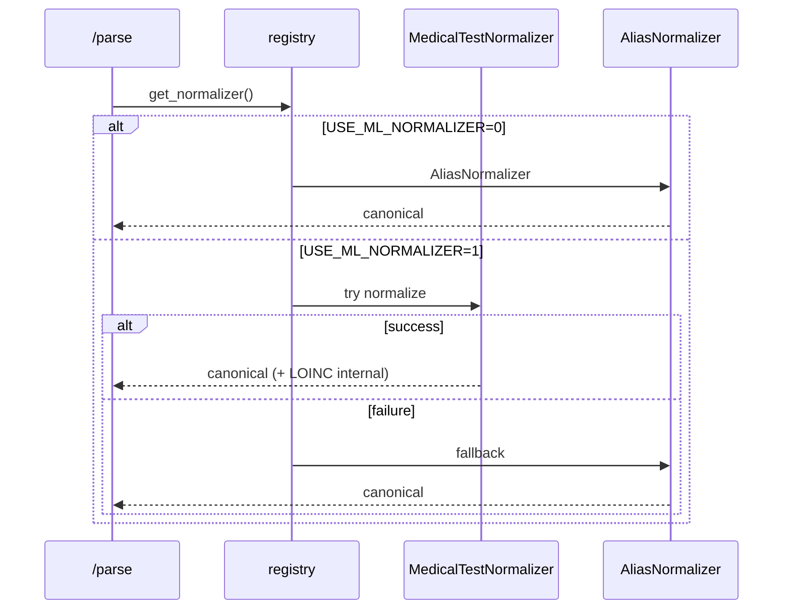

# Architecture — Normalizer (Phase 2)

```mermaid
sequenceDiagram
  participant Parse as /parse
  participant Reg as registry
  participant ML as MedicalTestNormalizer
  participant Rules as AliasNormalizer

  Parse->>Reg: get_normalizer()
  alt USE_ML_NORMALIZER=0
    Reg->>Rules: AliasNormalizer
    Rules-->>Parse: canonical
  else USE_ML_NORMALIZER=1
    Reg->>ML: try normalize
    alt success
      ML-->>Parse: canonical (+ LOINC internal)
    else failure
      Reg->>Rules: fallback
      Rules-->>Parse: canonical
    end
  end
```
