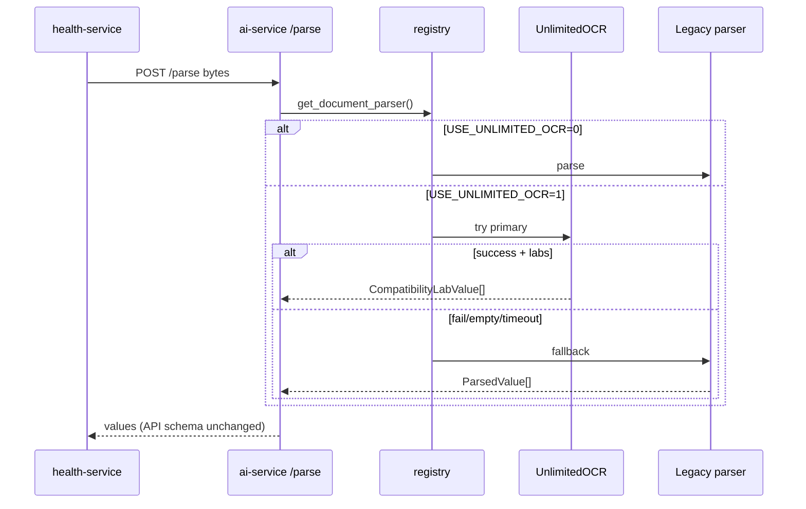

# Architecture — OCR path (Phase 1A)

Companion to `docs/02_ARCHITECTURE.md` and `docs/ML_ARCHITECTURE.md`.

```mermaid
sequenceDiagram
  participant HS as health-service
  participant AI as ai-service /parse
  participant Reg as registry
  participant U as UnlimitedOCR
  participant L as Legacy parser

  HS->>AI: POST /parse bytes
  AI->>Reg: get_document_parser()
  alt USE_UNLIMITED_OCR=0
    Reg->>L: parse
  else USE_UNLIMITED_OCR=1
    Reg->>U: try primary
    alt success + labs
      U-->>AI: CompatibilityLabValue[]
    else fail/empty/timeout
      Reg->>L: fallback
      L-->>AI: ParsedValue[]
    end
  end
  AI-->>HS: values (API schema unchanged)
```

Default production: flag off, legacy only.
