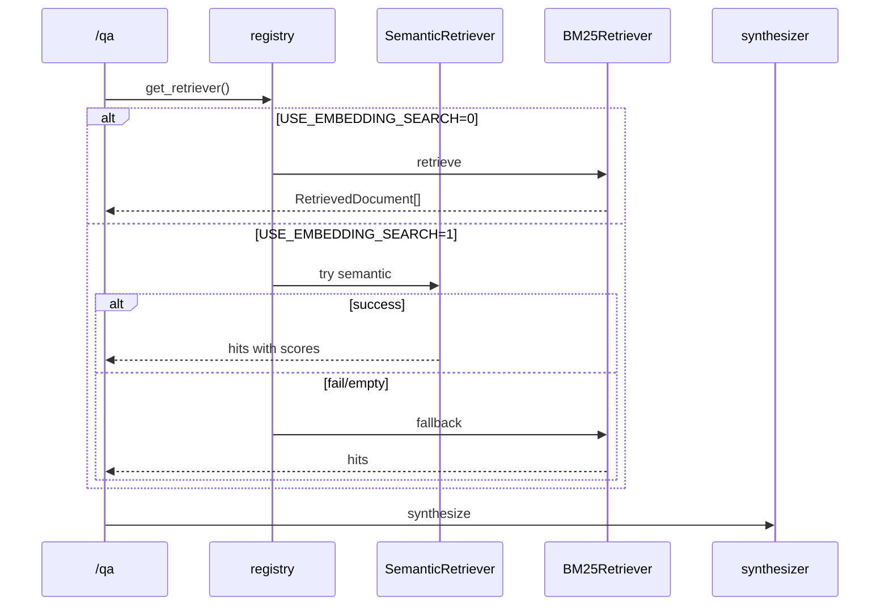

# Architecture — Semantic Retrieval (Phase 3)

```mermaid
sequenceDiagram
  participant QA as /qa
  participant Reg as registry
  participant Sem as SemanticRetriever
  participant BM as BM25Retriever
  participant Syn as synthesizer

  QA->>Reg: get_retriever()
  alt USE_EMBEDDING_SEARCH=0
    Reg->>BM: retrieve
    BM-->>QA: RetrievedDocument[]
  else USE_EMBEDDING_SEARCH=1
    Reg->>Sem: try semantic
    alt success
      Sem-->>QA: hits with scores
    else fail/empty
      Reg->>BM: fallback
      BM-->>QA: hits
    end
  end
  QA->>Syn: synthesize
```
