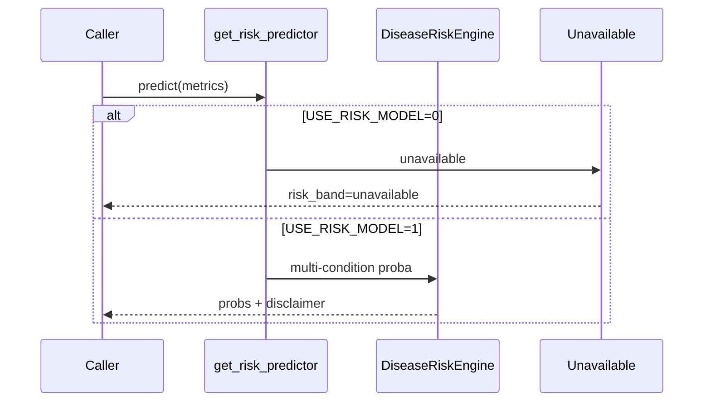

# Architecture — Disease Risk (Phase 4)

```mermaid
sequenceDiagram
  participant Caller
  participant Reg as get_risk_predictor
  participant ML as DiseaseRiskEngine
  participant Un as Unavailable

  Caller->>Reg: predict(metrics)
  alt USE_RISK_MODEL=0
    Reg->>Un: unavailable
    Un-->>Caller: risk_band=unavailable
  else USE_RISK_MODEL=1
    Reg->>ML: multi-condition proba
    ML-->>Caller: probs + disclaimer
  end
```
